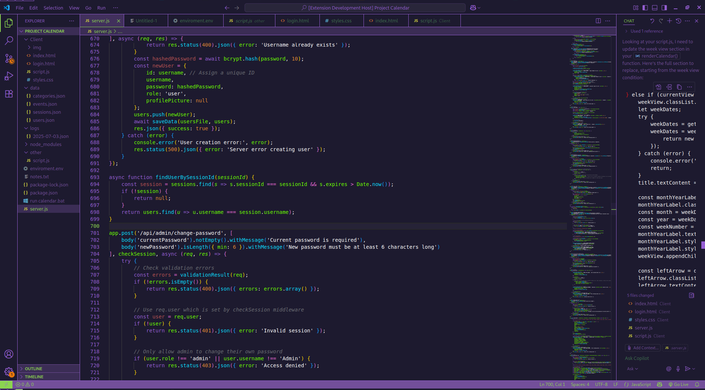

# EVA-01 Theme

The **EVA-01 Theme** is a vibrant, dark color theme inspired by the iconic purple and green aesthetic of the EVA-01 unit from *Neon Genesis Evangelion*. Designed for developers who crave a bold, neon-inspired coding environment, EVA-01 combines striking colors with excellent readability. Available for **Visual Studio Code** and **TextMate-compatible editors** (e.g., Sublime Text), this theme brings a futuristic vibe to your workflow.

## Features

- **Vibrant Dark Aesthetic**: Deep dark background (`#1d1a2f`) with neon accents like green (`#6bff00`), cyan (`#0bddff`), pink (`#f26dde`), and orange (`#e08733`) for a cohesive, eye-catching look.
- **Broad Language Support**: Syntax highlighting for numerous languages, including:
  - Python
  - JavaScript/TypeScript
  - Java
  - C/C++
  - Rust
  - PHP (including Laravel Blade)
  - CSS/SCSS/LESS
  - HTML
  - Markdown
  - JSON
  - Ruby
  - C#
  - Haskell
  - Regular Expressions
  - Diff
- **Semantic Highlighting (VS Code)**: Enhanced code clarity with semantic token support for constructs like `enumMember`, `variable.constant`, and more.
- **Custom UI Styling (VS Code)**: Tailored editor and interface colors, including:
  - Editor background and foreground
  - Status bar, sidebar, and activity bar
  - Terminal ANSI colors for vibrant output
  - Selection, hover, and bracket matching highlights
- **Italicized Comments**: Subtle italic styling for comments to improve readability without distraction.
- **High Contrast & Accessibility**: Vibrant colors designed for readability against a dark background, ensuring a comfortable coding experience.
- **TextMate Compatibility**: Available as a `.tmTheme` file for editors like Sublime Text, supporting syntax highlighting across platforms.

## Installation

### Visual Studio Code

1. **Via Marketplace** (if published):
   - Open VS Code and go to the Extensions view (`Ctrl+Shift+X` or `Cmd+Shift+X` on macOS).
   - Search for **EVA-01 Theme** and click **Install**.
   - Select the theme via `Ctrl+K Ctrl+T` or `Cmd+K Cmd+T` and choose **EVA-01**.

2. **Manual Installation**:
   - Download the theme from the [GitHub repository](https://github.com/luqezr/eva-01-theme-vscode/tree/main).
   - In VS Code, go to Extensions, click the `...` menu, and select **Install from VSIX**.
   - Choose the `.vsix` file and activate the theme via `Ctrl+K Ctrl+T`.

### Sublime Text / TextMate-Compatible Editors

1. Download `eva-01-color-theme.tmTheme` from the [GitHub repository](https://github.com/luqezr/eva-01-theme-vscode/tree/main).
2. Place the file in the appropriate directory:
   - **Sublime Text**: `Packages/User/` (access via `Preferences > Browse Packages`).
   - **TextMate**: `~/Library/Application Support/TextMate/Themes/`.
3. Select the theme:
   - **Sublime Text**: Add `"theme": "eva-01-color-theme.tmTheme"` to `Preferences > Settings`.
   - **TextMate**: Choose **EVA-01** from the theme selector.

## Screenshots

[Preview](screenshot1.png)
[Preview](screenshot2.png)

## Contributing

We welcome feedback and contributions! To contribute:
- Report issues or suggest features on the [GitHub Issues page](https://github.com/luqezr/eva-01-theme-vscode/tree/main).
- Submit pull requests with improvements or additional language support.

## License

This theme is licensed under the [MIT License](LICENSE).

---

*Inspired by the bold, neon spirit of EVA-01. Code like a pilot, sync with your editor!*

*made with <3 by kvx*